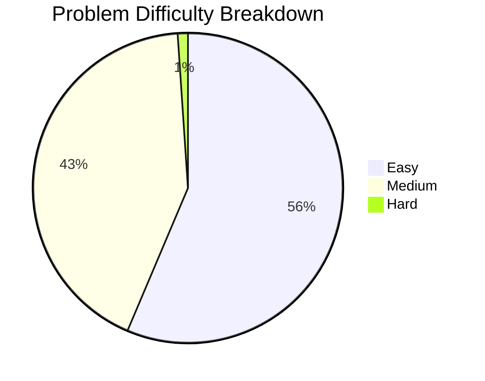

# 📈 LeetCode Solutions Statistics & Analytics

[⬅️ Back to Main README](../README.md) | [📚 View Topic Documentation](../docs/Easy.md)

---

## 🏆 Overall Solved Summary

- **Total Solved:** `94`
- 🟢 **Easy:** `53` (56.4%)
- 🟠 **Medium:** `40` (42.6%)
- 🔴 **Hard:** `1` (1.1%)

---

## 📊 Difficulty Distribution (Mermaid Pie Chart)

---

## 🗓️ Monthly Growth

| Month | Problems Solved | Cumulative Total |
| :---: | :---: | :---: |
| 2026-02 | 23 | 23 |
| 2026-03 | 30 | 53 |
| 2026-04 | 3 | 56 |
| 2026-06 | 8 | 64 |
| 2026-07 | 30 | 94 |

---

## 📅 Recent Weekly Growth

| Week | Problems Solved |
| :---: | :---: |
| 2026-W10 | 7 |
| 2026-W11 | 7 |
| 2026-W12 | 6 |
| 2026-W13 | 6 |
| 2026-W25 | 7 |
| 2026-W26 | 5 |
| 2026-W27 | 6 |
| 2026-W28 | 9 |
| 2026-W29 | 6 |
| 2026-W30 | 5 |

---

## 🕒 Latest 20 Solved Problems

| # | Problem Title | Difficulty | Primary Tags | Solution Link | Date Added |
| :---: | :--- | :---: | :--- | :---: | :---: |
| 1047 | [1047. Remove All Adjacent Duplicates In String](../1128-remove-all-adjacent-duplicates-in-string/) |  | String, Stack | [View Solution](../1128-remove-all-adjacent-duplicates-in-string/remove-all-adjacent-duplicates-in-string.java) | 2026-07-31 |
| 70 | [70. Climbing Stairs](../70-climbing-stairs/) |  | Math, Dynamic Programming, Memoization | [View Solution](../70-climbing-stairs/climbing-stairs.java) | 2026-07-31 |
| 771 | [771. Jewels and Stones](../782-jewels-and-stones/) |  | Hash Table, String | [View Solution](../782-jewels-and-stones/jewels-and-stones.java) | 2026-07-29 |
| 205 | [205. Isomorphic Strings](../205-isomorphic-strings/) |  | Hash Table, String | [View Solution](../205-isomorphic-strings/isomorphic-strings.java) | 2026-07-29 |
| 387 | [387. First Unique Character in a String](../387-first-unique-character-in-a-string/) |  | Hash Table, String, Queue | [View Solution](../387-first-unique-character-in-a-string/first-unique-character-in-a-string.java) | 2026-07-26 |
| 344 | [344. Reverse String](../344-reverse-string/) |  | Two Pointers, String | [View Solution](../344-reverse-string/reverse-string.java) | 2026-07-25 |
| 974 | [974. Subarray Sums Divisible by K](../1016-subarray-sums-divisible-by-k/) |  | Array, Hash Table, Prefix Sum | [View Solution](../1016-subarray-sums-divisible-by-k/subarray-sums-divisible-by-k.java) | 2026-07-24 |
| 1678 | [1678. Goal Parser Interpretation](../1797-goal-parser-interpretation/) |  | String | [View Solution](../1797-goal-parser-interpretation/goal-parser-interpretation.java) | 2026-07-23 |
| 1528 | [1528. Shuffle String](../1651-shuffle-string/) |  | Array, String | [View Solution](../1651-shuffle-string/shuffle-string.java) | 2026-07-22 |
| 1108 | [1108. Defanging an IP Address](../1205-defanging-an-ip-address/) |  | String | [View Solution](../1205-defanging-an-ip-address/defanging-an-ip-address.java) | 2026-07-21 |
| 169 | [169. Majority Element](../169-majority-element/) |  | Array, Hash Table, Divide and Conquer | [View Solution](../169-majority-element/majority-element.java) | 2026-07-19 |
| 560 | [560. Subarray Sum Equals K](../560-subarray-sum-equals-k/) |  | Array, Hash Table, Prefix Sum | [View Solution](../560-subarray-sum-equals-k/subarray-sum-equals-k.java) | 2026-07-18 |
| 1480 | [1480. Running Sum of 1d Array](../1603-running-sum-of-1d-array/) |  | Array, Prefix Sum | [View Solution](../1603-running-sum-of-1d-array/running-sum-of-1d-array.java) | 2026-07-16 |
| 918 | [918. Maximum Sum Circular Subarray](../954-maximum-sum-circular-subarray/) |  | Array, Divide and Conquer, Dynamic Programming | [View Solution](../954-maximum-sum-circular-subarray/maximum-sum-circular-subarray.java) | 2026-07-15 |
| 9 | [9. Palindrome Number](../9-palindrome-number/) |  | Math | [View Solution](../9-palindrome-number/palindrome-number.java) | 2026-07-15 |
| 1749 | [1749. Maximum Absolute Sum of Any Subarray](../1849-maximum-absolute-sum-of-any-subarray/) |  | Array, Dynamic Programming | [View Solution](../1849-maximum-absolute-sum-of-any-subarray/maximum-absolute-sum-of-any-subarray.java) | 2026-07-14 |
| 1186 | [1186. Maximum Subarray Sum with One Deletion](../1288-maximum-subarray-sum-with-one-deletion/) |  | Array, Dynamic Programming | [View Solution](../1288-maximum-subarray-sum-with-one-deletion/maximum-subarray-sum-with-one-deletion.java) | 2026-07-14 |
| 152 | [152. Maximum Product Subarray](../152-maximum-product-subarray/) |  | Array, Dynamic Programming | [View Solution](../152-maximum-product-subarray/maximum-product-subarray.java) | 2026-07-13 |
| 326 | [326. Power of Three](../326-power-of-three/) |  | Math, Recursion | [View Solution](../326-power-of-three/power-of-three.java) | 2026-07-12 |
| 53 | [53. Maximum Subarray](../53-maximum-subarray/) |  | Array, Divide and Conquer, Dynamic Programming | [View Solution](../53-maximum-subarray/maximum-subarray.java) | 2026-07-12 |

---

<i>Auto-generated by GitHub Actions LeetSync Workflow.</i>

